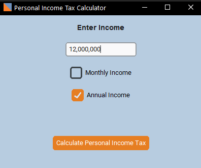

# Nigerian Income Tax Calculator 🧾

Easily estimate your monthly and annual income tax obligations in Nigeria with this simple, accurate tool.  

The calculator applies the **current tax brackets, relief allowances, and deductions** as specified under Nigerian tax laws, giving you a clear breakdown of your **taxable income, PAYE (Pay-As-You-Earn) deductions, and net take-home pay**.

---

## 📥 Download

👉 [Download the Windows Executable](assets/app.exe)

---

## 🖼 Preview



---

## 📖 Blog

Read more about the project and how it works here:  
👉 [Project Blog](https://www.linkedin.com/posts/chikamso-chidi-akoma-98b81a233_breakingnews-hottopic-viralpost-activity-7373334892409069568-xMoY?utm_source=share&utm_medium=member_desktop&rcm=ACoAADpR6fsBLexEJKrTQgE6dqXEx_2Ppb1Ksm8)

---

## ⚡ Features
- Calculate **monthly** or **annual** tax.
- Applies **relief allowances & deductions** automatically.
- User-friendly interface built with **CustomTkinter**.
- Works offline — no internet required.

---

## 🚀 How to Use
1. Download the `.exe` from the link above.  
2. Double-click to open the app.  
3. Enter your income, choose **monthly** or **annual**, and click **calculate**.  
4. Instantly view your tax breakdown and net take-home pay.  

---

## 🛠 Requirements (for source code)
If you want to run from source instead of the `.exe`:
```sh
pip install customtkinter pillow
python main.py
